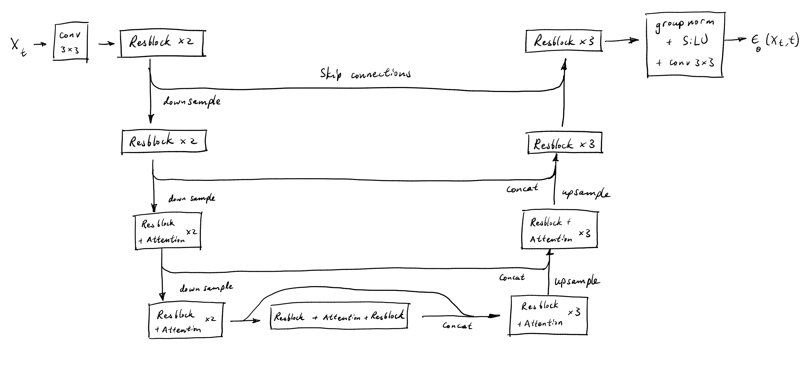
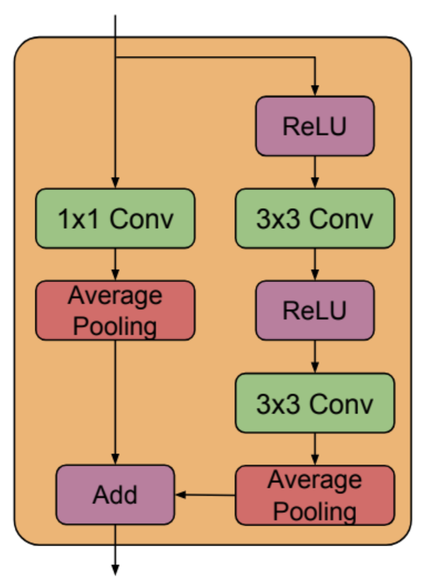
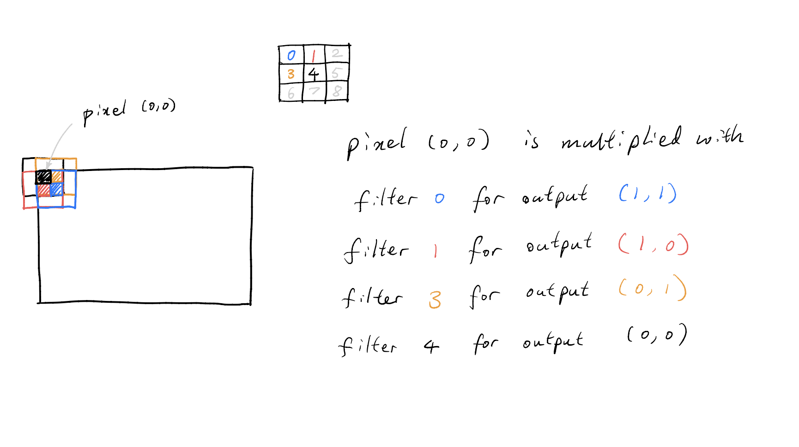
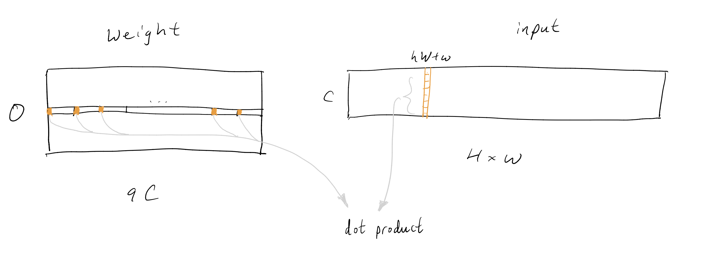
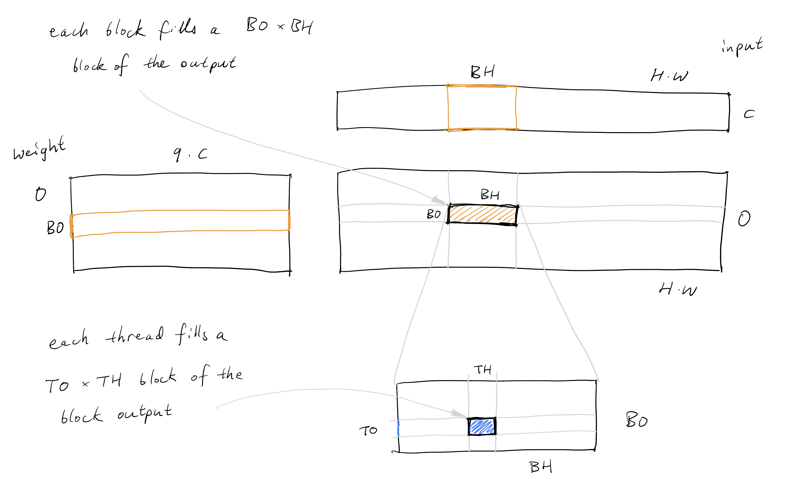
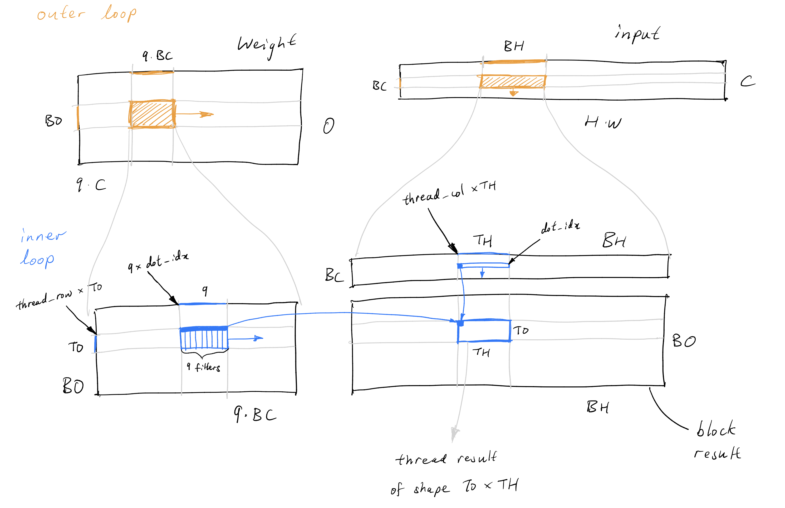
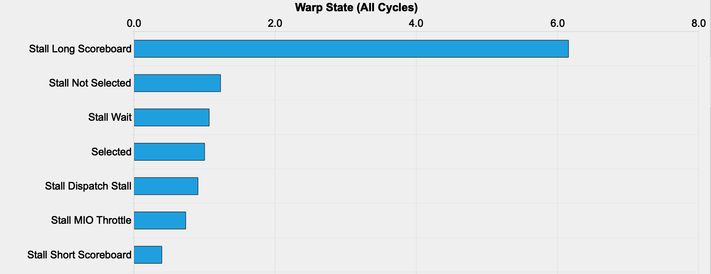
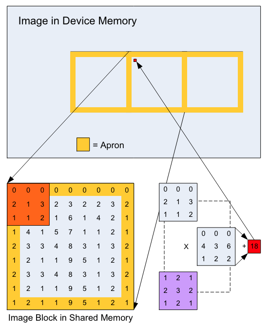

# unet.cu

TL;DR:

- UNet diffusion model training written in pure C++/CUDA (only unconditional diffusion right now).
- Currently end to end training runs at about 40% the speed of PyTorch Nightly. The following are benchmarks on one RTX 4090 GPU:

| Setup | one full training loop (ms) |
| --- | --- |
| This repo | 142.44 |
| PyTorch | 66.73 |
| PyTorch Nightly | 59.20 |

## Table of contents

- [unet.cu](#unetcu)
	- [Table of contents](#table-of-contents)
	- [Quick start](#quick-start)
	- [Introduction](#introduction)
	- [Background](#background)
		- [Diffusion models](#diffusion-models)
		- [UNet architecture](#unet-architecture)
	- [Version 1: naive implementation](#version-1-naive-implementation)
		- [Kernels taken from llm.c: linear, groupnorm, and attention](#kernels-taken-from-llmc-linear-groupnorm-and-attention)
		- [New kernels: upsample, downsample, and convolutions](#new-kernels-upsample-downsample-and-convolutions)
		- [Benchmarking the first kernel](#benchmarking-the-first-kernel)
	- [Version 2: custom convolution kernels](#version-2-custom-convolution-kernels)
		- [`3x3` convolution in detail](#3x3-convolution-in-detail)
		- [Background on CUDA](#background-on-cuda)
		- [Kernel details](#kernel-details)
		- [Profiling version 2](#profiling-version-2)
	- [Version 3: convolution kernels with vectorized loads](#version-3-convolution-kernels-with-vectorized-loads)
	- [Future directions](#future-directions)
		- [Forward pass](#forward-pass)
		- [Backward pass](#backward-pass)
		- [Other kernels](#other-kernels)
	- [Acknowledgements](#acknowledgements)

## Quick start

To train a diffusion model in CUDA with some sample images from [ImageNet 64x64](https://image-net.org/index.php), run the following:

```bash
gunzip data/elephant_train.bin.gz # prepare the data
python train_unet.py --init_model_only True # need to initialize model weights via python
make train_unet
./train_unet
```

To train the model with your own data, you need to create a `.bin` file with your data first:

```bash
python prepare_data.py --data_dir YOUR_DATA_DIR --output_name YOUR_BINARY_DATA_FILENAME.bin
# now run training, assuming you have already initialized the model as above
./train_unet --data_file YOUR_BINARY_DATA_FILENAME.bin
```

The PyTorch training code is essentially taken from the [guided-diffusion](https://github.com/openai/guided-diffusion) repo. To run PyTorch training, do:

```bash
python train_unet.py --data_dir YOUR_DATA_DIR # use --compile 0 if you don't want to call torch.compile() on the model
```

The CUDA training loop will save model weights in `.bin` files. To generate new images with model weights saved in either `.bin` or `.pt` files, run:

```bash
python generate.py --model_filename YOUR_MODEL_WEIGHTS_FILENAME
```

## Introduction

Inspired by Andrej Karpathy's [llm.c](https://github.com/karpathy/llm.c), I built a UNet from scratch in C/CUDA. The goal of the project is to learn the concepts in llm.c, and to reach for PyTorch's performance with our CUDA implementation. I chose the UNet because it is a key architecture for diffusion models, and I will do some simple diffusion model training with it.

Diffusion model training is quite sophisticated nowadays. Since this project is focused on learning CUDA as opposed to building the best diffusion model, I prioritized simplicity over performance, and followed the implementation from the paper [Diffusion Models Beat GANs on Image Synthesis](https://arxiv.org/abs/2105.05233). Currently the UNet only supports unconditioned diffusion training. I also did not reproduce all the model configurations from the paper; the details of the differences will be explained in the [section](#unet-architecture) on the architecture.

Here are some images generated with our CUDA implementation. The model is trained on elephant images from [ImageNet 64x64](https://image-net.org/index.php) without class-conditioning. The model is highly over fitting the training set right now, but at least this confirms training is working.

<p align="center">
  
  
  
</p>


The Github repository is organized as follows:

- The `dev/` directory contains all different kernels and tests written during development.
	- Most neural network layers have two corresponding files: a `.cu` file (e.g. `groupnorm.cu`), which contains different CUDA kernels for a layer, and a `.py` file (e.g. `groupnorm.py`), which contains an identical Pytorch implementation for the same layer.
	- We check the correctness of the CUDA kernels by checking that they produce the same outputs in both forward and backward passes as the ground truth PyTorch versions (up to floating point errors).
- `train_unet.cu` is a single file with the full diffusion model training code (~ 5000 lines). We take the best kernels from `dev/` and copy them here. The file also contains things like the data loader and AdamW.

For a tutorial on how to write the forward and backward pass of different layers, I recommend Andrej's [layernorm tutorial](https://github.com/karpathy/llm.c/blob/master/doc/layernorm/layernorm.md).

The rest of these notes are organized as follows. The next section will cover some background, both on diffusion models and on the UNet architecture we use. Then the later sections document successive iterations on the model where I benchmark kernels and try to speed things up. It turns out that most of a UNet's running time is spent doing `3x3` image convolutions, so that is where most of the work went into and where these notes focus on.

## Background

### Diffusion models

Our goal is to train a diffusion model with a UNet. Let me give a short summary of how diffusion models work. A good mathematical description can be found in Appendix B of the paper [Diffusion Models Beat GANs on Image Synthesis](https://arxiv.org/abs/2105.05233); a good hands-on tutorial can be found at Chenyang Yuan's [blog](https://www.chenyang.co/diffusion.html). We start with a target distribution  $\pi(x)$ on $\mathbb{R}^d$ that we want to sample from. In our case, the space will be RGB images with $C = 3$ channels, height and weight $H = W = 64$, and $d = C \times H \times W$, and the target distribution will be elephant images. The key idea is to set up a stochastic process $(X_t)_{t \ge 0}$ with the following three properties:

1. At $t = 0$, $X_0$ is exactly sampled from $\pi(x)$.
2. When $t$ is very large, $X_t$ is very close in distribution to the standard Gaussian distribution on $\mathbb{R}^d$.
3. Given $X_t$, we can learn to sample from the conditional distribution $\pi(X_{t-1} \mid X_t)$.

These properties together enable us to draw samples from the target $\pi$ as follows:

1. We draw a standard Gaussian random vector, and treat it as a sample of $X_T$ for a large $T$. This is valid because of property 2.
2. Then, given $X_t$, we successively sample $X_{t-1}$ using property 3.
3. Eventually we can sample from $X_0$, which by property 1 is exactly distributed as the target $\pi$.

So now we need a stochastic process that satisfies these properties, and a way to learn the conditional distributions in property 3. The stochastic process $(X_t)_{t \ge 0}$ will look like so: $X_0$ is drawn from $\pi$, and $X_t$ is distributed as follows:

$$
X_t = \sqrt{\alpha_t} \cdot X_0 + \sqrt{1 - \alpha_t}\cdot \epsilon,
$$

where $\epsilon$ is a standard Gaussian in $\mathbb{R}^d$, and $\alpha_t$ is a non-increasing function of $t$ that we will choose, with the properties that $\alpha_0 = 1$ and $\alpha_t \to 0$ as $t \to \infty$. We see that when $t$ is large, $X_t \approx \epsilon$, which satisfies property 2. Note that the equation above is only specifying the marginal distribution of $X_t$, so the conditional distribution $\pi(X_{t-1} \mid X_t)$ may not be deterministic (when the conditional is deterministic, we have the [DDIM](https://arxiv.org/abs/2010.02502) models).

To sample from the conditional distribution $\pi(X_{t-1} \mid X_t)$, we will train a model $\epsilon_\theta(X_t, t)$ that takes $X_t$ and $t$ as input and minimizes the following objective:

$$
L = \mathbb{E}[\lVert \epsilon - \epsilon_\theta(X_t, t) \rVert^2].
$$

Here the expectation is taken over $\epsilon$, $t$ and $X_t$, where $t$ uniformly sampled from the range $[0, T]$, $\epsilon$ is sampled from the standard Gaussian, $X_0$ is sampled from $\pi$ (i.e. one of our training data), and $X_t$ is then constructed from $X_0$, $t$, and $\epsilon$ using the identity above. Conceptually the model $\epsilon_\theta$ takes in the noisy input $X_t$, and tries to learn the noise component $\epsilon$ within the input. With this model, it is then fairly easy to do the conditional sampling from $\pi(X_{t - 1} \mid X_t)$; the details can be found in Appendix B of [Diffusion Models Beat GANs on Image Synthesis](https://arxiv.org/abs/2105.05233).

### UNet architecture

Our loss function dictates that we want a model which takes an input of shape `(B, C, H, W)`, where `B` is the batch dimension, and returns an output of the same shape. The UNet is a sample efficient architecture designed specifically for such scenarios. The UNet we use is a basic version taken from the paper [Diffusion Models Beat GANs on Image Synthesis](https://arxiv.org/abs/2105.05233), and it looks like this:

<p align="center">
  
</p>

Specifically, we use the residual blocks from BigGAN, which look like so (from Figure 15 of [Large Scale GAN Training for High Fidelity Natural Image Synthesis](https://arxiv.org/abs/1809.11096) ):

<p align="center">
  
</p>

A few more notes on model details:

- During the upsample blocks, we concatenate the skip connections from the corresponding downsampling blocks into the input.
- To do diffusion model training, we also need to take in time step embeddings.
	- We use sinusoidal embeddings. Then we pass the embeddings through a fully connected layer, and add the embeddings to the input of each Residual block.
- We do not currently support dropout.
- In [Diffusion Models Beat GANs on Image Synthesis](https://arxiv.org/abs/2105.05233), they use a custom normalization layer called adaptive group normalization. We currently don't support this.
- The full code for our UNet can be found in `train_unet.py`. Our model exactly matches the [official implementation](https://github.com/openai/guided-diffusion) with the following model configurations:

```bash
--attention_resolutions 16,8 --class_cond False --diffusion_steps 1000 --dropout 0.0 --image_size 64 --learn_sigma False --noise_schedule linear --num_channels 64 --num_head_channels 32 --num_res_blocks 2 --resblock_updown False --use_new_attention_order True --use_fp16 False --use_scale_shift_norm False
```

## Version 1: naive implementation

### Kernels taken from llm.c: linear, groupnorm, and attention

In the first version I wanted to get something working quickly, so I copied or adapted the kernels from llm.c. This approach took care of some kernels: the linear layer could be reused from llm.c without adaption; the groupnorm layer is different from the layernorm in llm.c, but we only needed to change the axis we reduce over and then we had a working kernel.

The self-attention layer was trickier. At first glance the adaptation seems straightforward: the attention layer functions identically for transformers and image models, and the only difference is that instead of the inputs having shape `(B, T, C)`, they now have `(B, C, H, W)`. So we can reuse the transformer attention kernels by first transposing the inputs to shape `(B, H * W, C)`, then calling the kernels with `T = H * W`, then transposing the output back to shape `(B, C, H, W)`.

This turns out to be highly inefficient, because for each transpose we need to move a block of size `B * C * H * W` in and out of GPU global memory, and as we will see later such steps should be avoided. So the attention kernels will be an obvious place for future improvements.

### New kernels: upsample, downsample, and convolutions

Several kernels did not exist in llm.c, but they are needed for the UNet. They are:

- Up and down sample,
- `3x3` and `1x1` convolutions.

The up and down sample kernels (nearest interpolation and average pooling respectively) are easy: there is barely any computation, and we easily parallelize them by assigning one pixel to each GPU thread.

So we are left with the convolution kernels. I wanted to get something working quickly, but I also didn't want it to be too slow, so my plan was to convert all the convolutions to matrix multiplications, and then use cuBLAS, which should be fast.

This plan is quite natural for the `1x1` convolution: for inputs of shape `(B, C_in, H, W)` and weights of shape `(C_out, C_in)`, the forward pass for a `1x1` convolution is essentially a matrix multiplication in the `C_in` dimension of the input with the weights. So `1x1` convolutions are done with the following steps:

1. transpose the input from `(B, C_in, H, W)` to `(B * H * W, C_in)`,
2. do a single matrix multiplication of the input with the weights with cuBLAS SGEMM to get an output of shape `(B * H * W, C_out)`, then add the bias,
3. transpose the output back to shape `(B, C_out, H, W)`.

Notice again that this approach needs two transposes of the entire input array, which are expensive. In iteration 2 we will write a custom kernel that avoids these transposes.

For the `3x3` convolutions, things are trickier. Let's focus on the forward pass, where the shapes of the relevant parameters are as follows:

- input: `(B, C_in, H, W)`,
- weight: `(C_out, C_in, 3, 3)`,
- output: `(B, C_out, H, W)`.

Since the plan is to cast the convolution into a matmul, it seems natural to transpose the input and output to shapes `(B * H * W, C_in)` and `(B * H * W, C_out)` respectively. For the weight tensor, we can think of it as consisting of 9 different weight matrices, all of shape `(C_out, C_in)`, where each one corresponds to one of the 9 filters in the `3x3` convolution. Let's introduce some notation: let the transposed input be $X \in \mathbb{R}^{(B\cdot H \cdot W) \times C_\text{in}}$, the transposed output be $Y \in \mathbb{R}^{(B\cdot H\cdot W) \times C_\text{out}}$, and let the weight tensor be $W\in \mathbb{R}^{C_\text{out} \times C_\text{in} \times 9}$, where $W = (W_0, \dots, W_8)$, and each $W_i \in \mathbb{R}^{C_\text{out} \times C_\text{in}}$ is the weight matrix for filter $i \in \{0, \dots, 8\}$.

The convolution of a single pixel works by multiplying the pixels with the 9 filters and summing the values. So roughly speaking, the convolution for the entire batch looks something like this:

1. For each filter $i$, multiply the transposed input $X$ and the filter weight $i$ and obtain an output $X W_i^\intercal$ of shape `(B * H * W, C_out)`.
2. Sum over the filters and obtain the transposed output $XW_0^\intercal  + \dots XW_8^\intercal$.

So we have turned the `3x3` convolution into matrix multiplications. Except this is not quite right, because not every pixel is multiplied with every filter. For instance, if we think of the top left pixel in the input, it will only ever be multiplied with weights from filters 0, 1, 3 and 4, as shown in this sketch.

<p align="center" id="pixel-filter">
  
</p>

The correct solution will have to ignore the pixel-filter combinations that never occur in the output. It can be roughly described as follows:

1. Create a tiled input matrix `X_tilde` of shape `(B * H * W, 9 * C_in)`, such that the values in `X_tilde[:, i*C_in : (i+1)*C_in]` are values that will be multiplied with filter $i$. If an input pixel is never multiplied with a filter, then the corresponding values for that pixel in `X_tilde` will be filled with zeros.
2. Treat $W$ as a `(C_out, C_in * 9)` matrix, and do a single matrix multiplication `X_tilde @ W.T` to get the transposed output of shape `(B * H * W, C_out)`.
3. Transpose the output to the desired shape `(B, C_out, H, W)`.

The backward pass is a little more involved, but uses essentially the same ideas.

Just looking at this algorithm should make us a bit nervous: we will have to be reading and writing arrays of size `9 * B * C_in * H * W` in and out of global memory, which is definitely not optimal. But at least we now have a fully working version of all the kernels, so let's see how fast our UNet is.

### Benchmarking the first kernel

Let's compare our UNet's performance to the same model in PyTorch. These benchmarks are run on an RTX 4090:

| | PyTorch | CUDA version 1 |
| --- | --- | --- |
| forward pass | 20.6177 | 171.8496 |
| backward pass | 35.5240 | 221.4288 |

Our kernel is current quite slow. What is it spending its time doing? The following benchmarks show that most of the time of the forward pass is spent on the residual and attention layers:

| Operation | time (ms) |
| --- | --- |
| UNet forward pass | 171.8496 |
| All ResBlocks forward | 146.0608 |
| All Attention forward | 3.8242 |

In fact, the overwhelming majority of the time is spent on residual blocks alone. Within a residual block, the majority of the time is spent on the `3x3` convolutions. The following shows the forward pass time for the most time consuming residual block, with `C_in = 192`, `C_out = 64` ,`H = 64` and `W = 64`, which contains one `3x3` convolution with `C_in = 192` and `C_out = 64`, and another `3x3` convolution with `C_in = 64` and `C_out = 64`. We compare the forward pass time of the residual block to the times for the two convolutions alone:

| Operation | time (ms) |
| --- | --- |
| ResBlock forward | 20.2515 |
| Conv `3x3` `C_in = 192` forward | 15.1184 |
| Conv `3x3` `C_in = 64` forward | 5.7589 |

In these benchmarks the sum of the convolution times actually slightly exceed the residual block time, which is likely due to the extra `cudaEventSynchronize` calls we make when benchmarking the convolutions separately. The point here is that most of the time in residual blocks is spent in the convolution kernels. So what is taking so long in the convolution kernels? Here is a breakdown for the forward pass of the `3x3` convolution with `C_in = 192`, `C_out = 64`, `H = 64` and `W = 64`:

| Operation | time (ms) |
| --- | --- |
| allocate + memset buffers | 9.7122 |
| transpose + fill `X_tilde` | 1.3283 |
| cuBLAS SGEMM | 1.1411 |
| transpose output + add bias | 0.0547 |
| free buffers | 2.8671 |
| Conv `3x3` `C_in = 192` total forward time | 15.1033 |

First, a lot of time is wasted doing something very silly: allocating the memory buffers needed for the layer when the layer is called. I'm not sure why I wrote this layer this way; all the other layers use a chunk of a large memory buffer that is allocated at once. This will be an easy speedup gain, and should already bring the convolution forward pass down to about 3 ms.

Second, a significant amount of time is spent transposing and filling in the `X_tilde` matrix, which is only needed because we are trying to shoehorn the convolution through a matmul. If we could avoid this step, we could hope to reduce the time for the entire kernel to just the time for the cuBLAS SGEMM step, which is doing all the computation. In fact, it turns out that PyTorch convolution is even faster than the SGEMM step above:

| Conv `3x3` `C_in = 192` forward | time (ms) |
| --- | --- |
| CUDA version 1 | 15.1033 |
| SGEMM step in CUDA kernel | 1.1411 |
| PyTorch | 0.4574 |

This makes sense, beecause `X_tilde` essentially consists of the input $X$ tiled 9 times, which means that for the SGEMM step we are moving unneccessary memory in the GPU.

The story for the backward pass is similar: most of the UNet backward pass is spent in residual blocks:

| Operation | time (ms) |
| --- | --- |
| UNet backward pass | 221.4288 |
| All ResBlocks backward | 204.7654 |
| All Attention backward | 3.8242 |

And the residual backward pass (for residual block with `C_in = 192`, `C_out = 64`, `H = 64`, `W = 64`) spends most of its time doing two convolution backward passes:

| Operation | time (ms) |
| --- | --- |
| ResBlock backward | 28.0355 |
| Conv `3x3` `C_in = 192` backward | 15.4565 |
| Conv `3x3` `C_in = 64` backward | 7.0649 |

The convolution backward pass is again wasting time allocating buffer memory and moving a lot of data, though the fraction of time spent doing computations is higher than in the forward pass (benchmark with `C_in = 192`, `C_out = 64`, `H = 64`, `W = 64`):

| Operation | time (ms) |
| --- | --- |
| allocate + memset buffers | 3.4855 |
| transpose + fill `X_tilde` | 5.7071 |
| cuBLAS SGEMM for `dweight` | 1.1801 |
| cuBLAS SGEMM + reduce for `dinput` | 2.3308 |
| reduce for `dbias` | 0.0810 |
| free buffers | 2.6721 |
| Conv `3x3` `C_in = 192` backward time | 15.4565 |

And here is the comparison between our convolution backwards pass and PyTorch's version:

| Conv `3x3` `C_in = 192` backward | time (ms) |
| --- | --- |
| CUDA version 1 | 15.4565 |
| PyTorch | 2.3417 |

To summarize, the main bottleneck of the UNet is currently the `3x3` convolution, and we can speed that up by avoiding very expensive `cudaMalloc` calls to create buffers, and avoiding expensive transpose and tiling operations.

## Version 2: custom convolution kernels

In the second version, we re-write the forward and backward kernels for the `3x3` convolution to avoid memory transfers. In this section I will go through the details of the forward pass. The section is organized as follows: first we describe the details of the convolution algorithm; then we cover some background on CUDA programming; finally wo go through the details of our CUDA kernel.

### `3x3` convolution in detail

Say we are doing a `3x3` convolution, with input channels `C`, output channels `O`, image height `H`, width `W`, and batch size `B`. The weight is shaped as `(O, C, 3, 3)`, which we can treat as a `(O, C * 3 * 3)` matrix. The input is shaped as `(B, C, H, W)`. We will parallelize the batch dimension of the input with different threads (more on this in the [next section](#background-on-cuda)), so we can effectively think of the input as a `(C, H * W)` shaped matrix.

Recall from the earlier [sketch](#pixel-filter) that not all pixels are multiplied with all the convolutional filters. The relationship between the starting pixel $(h, w)$, the filter $i$, for $i \in \{0, \dots, 8\}$, and the output pixel is given as follows:

$$
(h, w) \overset{\text{filter }i}{\to} (h + 1 - \lfloor i / 3 \rfloor, w + 1 - (i \text{ mod } 3))\, ,
$$

and $(h, w)$ will be multiplied with filter $i$ if the output pixel is within range of the image. So if we want to compute the contribution to the output channel $o$ from the input pixel $(h, w)$ and filter $i$, we need to take a dot product between the $h W + w$ column of the input matrix, with elements at indices $9 c + i$ on row $o$ of the weight matrix, for $c = 0, \dots, C - 1$, as shown in the following sketch.

<p align="center" id="conv-computation">
  
</p>

### Background on CUDA

I highly recommend Simon Boehm's blog on [how to optimize a CUDA Matmul kernel](https://siboehm.com/articles/22/CUDA-MMM), which is where I learnt all the optimization techniques.

We start with a few notes on how the GPU and the CUDA programming model works:

- Each call to a CUDA kernel creates a grid, which consists of multiple blocks, and each block consists of up to 1024 threads. Furthermore the threads are launched in groups of 32 called warps.
- For memory, the GPU has global memory (of several GB) that can be accessed by all threads in all blocks. Then each block has shared memory (SMEM, of several KB) that can be accessed by all the threads in that block. Finally each thread has some local registers that can be accessed by the thread alone.

Usually a CUDA kernel works like so:

- You start with all the relevant data in GPU global memory.
- Because SMEM is much faster than global memory, you load the relevant data for each block from global memory into SMEM before doing any computation.
- Each thread in a block computes using data from the block SMEM, and writes its outputs into an output buffer in global memory.

A few things to watch out for that I learnt from Simon's [blog](https://siboehm.com/articles/22/CUDA-MMM):

- Most of the work goes into making sure that the kernels are always doing computations and seldom stalling to wait for memory loads.
- When loading from global memory, you want to make sure that adjacent threads are loading adjacent memory locations, so global memory access can be coalesced and loads are much faster. The same thing also applies to SMEM loads.
- Having many threads trying to load from SMEM can result in stalling as well. So instead of relying on SMEM for computations, you actually want to load data first into thread registers, and then use data in registers to do computations.

### Kernel details

With these points in mind, we can write our `3x3` convolution kernel. We will be roughly following the Matmul [kernel 5](https://github.com/siboehm/SGEMM_CUDA/blob/master/src/kernels/5_kernel_2D_blocktiling.cuh) of Simon's blog, since the convolution looks [roughly like a Matmul](#conv-computation). As mentioned, we will work with a weight matrix of shape `(O, 9 * C)`, an input of shape `(C, H * W)`, produce an output of shape `(O, H * W)`, and repeat this in parallel for the different batches. Each block will fill out a `(BO, BH)` shaped subset of the output, and each thread within each block will fill out a `(TO, TH)` shaped subset of the block's output, as shown below.

<p align="center" id="conv-computation">
  
</p>

For each block, we loop over the `C` axis on which the dot products are taken. In each iteration, a block loads a `(BO, 9 * BC)` chunk of the weights and a `(BC * BH)` chunk of the inputs into SMEM. Then each thread will loop over the `BC` axis of the SMEM arrays. In each iteration, a thread loads a `(TO, 9)` chunk of the SMEM weights and `(1, TH)` chunk of the SMEM inputs into local registers, and computed the appropriate product. This process is illustrated below.

<p align="center" id="conv-computation">
  
</p>

The relevant part of the code is as follows:

```cpp
// shared mem for loading weights and input x
const int w_s_sz = BO * BC * 9;
const int w_s_width = BC * 9;
const int x_s_sz = BC * BH;
__shared__ float w_s[w_s_sz];
__shared__ float x_s[x_s_sz];

// registers to store local results
float thread_results[TO * TH * 9] = {0.0};
// registers for weights and x
float reg_w[TO] = {0.0};
float reg_x[TH] = {0.0};

// calculate offset in x for bounds checking later
const int x_block_offset = batch * C * H * W + block_col * BH;
// calculate weight offset for bounds checking
const int w_block_offset = block_row * BO * C9;

// outer loop over BC size blocks of channel C
for (int c_idx = 0; c_idx < C; c_idx += BC) {
	// x and weight offsets for this block
	int x_inner_offset = c_idx * H * W;
	int w_inner_offset = c_idx * 9;
	// load weight into smem
	int w_abs_idx;
	for (int i = threadIdx.x; i < w_s_sz; i += blockDim.x) {
		int w_i = i / w_s_width;
		int w_j = i % w_s_width;
		w_abs_idx = w_block_offset + w_inner_offset + w_i * C9 + w_j;
		if (w_abs_idx < weight_size) {
			w_s[w_i * w_s_width + w_j] = weight[w_abs_idx];
		}
	}
	// load x into smem
	int x_abs_idx;
	for (int i = threadIdx.x; i < x_s_sz; i += blockDim.x) {
		int x_i = i / BH;
		int x_j = i % BH;
		x_abs_idx = x_block_offset + x_inner_offset + x_i * H * W + x_j;
		if (x_abs_idx < x_size) {
			x_s[x_i * BH + x_j] = x[x_abs_idx];
		}
	}
	__syncthreads();

	// calculate per thread results
	for (int dot_idx = 0; dot_idx < BC; dot_idx++) {
		// load x_s into registers
		for (int j = 0; j < TH; j++) {
			reg_x[j] = x_s[dot_idx * BH + thread_col * TH + j];
		}
		for (int conv_idx = 0; conv_idx < 9; conv_idx++) {
			for (int i = 0; i < TO; i++) {
				reg_w[i] = w_s[(thread_row * TO + i) * w_s_width + dot_idx * 9 + conv_idx];
			}

			for (int i = 0; i < TO; i++) {
				for (int j = 0; j < TH; j++) {
					float val = reg_w[i] * reg_x[j];
					thread_results[conv_idx * TO * TH + i * TH + j] += val;
				}
			}
		}
	}
	__syncthreads();
}

// write out results
// need to be careful here: for each pixel at (h_abs, w_abs) and its product with kernel k (k < 9)
// There are 2 options
// 1. the product should be added to some pixel, then do an atomiAdd
// 2. the product should not contribute to any pixel because it would be out of bound, in this case just skip
int out_batch_offset = batch * O * H * W;
for (int j = 0; j < TH; j++) {
	int hw_abs = block_col * BH + thread_col * TH + j;
	int h_abs = hw_abs / W;
	int w_abs = hw_abs % W;
	for (int i = 0; i < TO; i++) {
		int o_abs = block_row * BO + thread_row * TO + i;
		for (int k = 0; k < 9; k++) {
			int k_i = k / 3;
			int k_j = k % 3;
			int h_target_abs = h_abs + 1 - k_i;
			int w_target_abs = w_abs + 1 - k_j;
			if (h_target_abs >= 0 && h_target_abs < H && w_target_abs >= 0 && w_target_abs < W) {
				int out_target_abs = out_batch_offset + o_abs * H * W + h_target_abs * W + w_target_abs;
				int th_res_idx = k * TO * TH + i * TH + j;
				atomicAdd(out + out_target_abs, thread_results[th_res_idx]);
			}
		}
		int out_abs = out_batch_offset + o_abs * H * W + h_abs * W + w_abs;
		atomicAdd(out + out_abs, bias[o_abs]);
	}
}
```

Notice that we need to do `atomicAdd` when writing the thread results to the output. This is because in the convolution, each output pixel has contributions from 9 different input pixels, and the inputs for one output pixel might be loaded and computed by different threads.

After autotuning for the values of `BO = 8`, `BH = 256`, `BC = 16`, `TO = 2` and `TH = 4`, on the same setting before with `C = 192`, `O = 64`, `H = 64`, `W = 64`, we now get a drastic improvement over version 1:

| Conv `3x3` `C_in = 192` forward | time (ms) |
| --- | --- |
| CUDA version 1 | 15.1033 |
| CUDA version 2 | 2.0132 |
| PyTorch | 0.4574 |

We are still some way off from PyTorch. Let's profile the kernel to see how we can improve it.

### Profiling version 2

The warp stall statistics shows that there is a lot of long scoreboard stalls:

<p align="center" id="conv-computation">
  
</p>

The [Kernel Profiling Guide](https://docs.nvidia.com/nsight-compute/ProfilingGuide/#metrics-reference) says the following about long scoreboard stalls:

> Warp was stalled waiting for a scoreboard dependency on a L1TEX (local, global, surface, texture) operation.

Tracking down the instruction that causes the stalls, we find that most of the stalling occurs when loading the input matrix into SMEM. This makes sense: with the current block sizes we are loading chunks of size `8 * 9 * 16` of the weight matrix and chunks of size `256 * 16` of the input matrix into SMEM for each iteration, and the large input buffer size becomes the bottleneck.

A natual idea at this point would be to decrease the width `BH` of the input chunk loaded into SMEM. But all such parameter changes within a reasonable range actually decrease performance. The main reason is that as `BH` is decreased, the number of blocks and threads increase (each block fills an output block of size `BO * BH`, which means we need `(O * H * W) / (BO * BH)` blocks; the number of threads in each block is usually kept around constant for better occupancy), at which point the line where we call `atomicAdd` to write to the output becomes the bottleneck. There are now many more output pixels which multiple blocks will write to, and the writes have to be serial.

To really make progress on this issue requires rethinking the algorithm and possibly getting rid of the atomic writes. But before we do that, we can try a simple trick for speeding up memory loads: vectorize memory access.

## Version 3: convolution kernels with vectorized loads

This technique is introduced in kernel 6 of [Simon's blog](https://siboehm.com/articles/22/CUDA-MMM). Instead of loading the floats one by one, we use the `float4` data type to load 4 of them at once. Here is the new code for loading the input into SMEM:

```cpp
// load x into smem
for (int i = threadIdx.x; i < x_s_sz / 4; i += blockDim.x) {
	int inner_col = i % (BH / 4);
	int inner_row = i / (BH / 4);
	reinterpret_cast<float4 *>(&x_s[inner_row * BH + inner_col * 4])[0] = 
		reinterpret_cast<float4 *>(&x[x_block_offset + x_inner_offset + inner_row * H * W + inner_col * 4])[0];
}
```

We do the same when loading the weight matrix. We also transpose the SMEM layout for the weights to enable vectorized SMEM loads. Here is the new code:

```cpp
// load weight into smem
for (int i = threadIdx.x; i < w_s_sz / 4; i += blockDim.x) {
	int inner_col = i % (w_s_width / 4);
	int inner_row = i / (w_s_width / 4);
	float4 tmp = 
		reinterpret_cast<float4 *>(&weight[w_block_offset + w_inner_offset + inner_row * C9 + inner_col * 4])[0];
	w_s[(inner_col * 4 + 0) * BO + inner_row] = tmp.x;
	w_s[(inner_col * 4 + 1) * BO + inner_row] = tmp.y;
	w_s[(inner_col * 4 + 2) * BO + inner_row] = tmp.z;
	w_s[(inner_col * 4 + 3) * BO + inner_row] = tmp.w;
}
```

Finally, we also vectorize the reads of the input from SMEM to local registers:

```cpp
// load x_s into registers
// NOTE: relying on the fact that TH = 4
reinterpret_cast<float4 *>(reg_x)[0] = reinterpret_cast<float4 *>(&x_s[dot_idx * BH + thread_col * TH])[0];
```

We cannot vectorize the register loads for the weight matrix because everytime we are loading `TO * 9 = 18` entries only, which is not a multiple of 4.

With these changes, the new kernel runs at about 30% faster than the version 2 kernel:

| Conv `3x3` `C_in = 192` forward | time (ms) |
| --- | --- |
| CUDA version 1 | 15.1033 |
| CUDA version 2 | 2.0132 |
| CUDA version 3 | 1.3137 |
| PyTorch | 0.4574 |

After also writing a custom kernel for the `1x1` convolutions, the forward pass is now at about 2/3 the speed of PyTorch and around 45% of the speed of PyTorch Nightly with `torch.compile`:

| Setup | UNet forward pass (ms) |
| --- | --- |
| CUDA version 3 | 32.8169 |
| PyTorch | 20.6177 |
| PyTorch Nightly | 13.4731 |

I tried all the similar techniques mentioned above on optimizing the backward pass of the `3x3` convolution, but right now the speed is still some way off PyTorch:

| Setup | UNet backward pass (ms) |
| --- | --- |
| CUDA version 3 | 106.2939 |
| PyTorch | 35.5240 |
| PyTorch Nightly | 31.7437 |

I will discuss some challenges in opitmizing the backward pass in the next section.

Here are the full training loop times, reproduced from the start of these notes:

| Setup | one full training loop (ms) |
| --- | --- |
| This repo | 142.44 |
| PyTorch | 66.73 |
| PyTorch Nightly | 59.20 |

## Future directions

Here are some ideas I will try out if I get back to working on this project.

### Forward pass

Right now the UNet forward pass spends almost all of its time in the residual blocks:

| CUDA version 3 | forward pass time (ms) |
| --- | --- |
| UNet | 32.8169 |
| Residual blocks | 28.3621 |
| Attention | 3.9185 |

And just as before, most of the time of the residual blocks are spent in the `3x3` convolutions. So to reach PyTorch's performance we mainly have to optimize the convolution kernels.

As mentioned in an [earlier section](#profiling-version-2), our current kernel is blocked on loading large chunks of the input matrix into SMEM, but if we try to reduce the size of the SMEM buffer, we need to spin up more blocks and threads, which makes the atomic writes to the outputs slow. So the natural ideas to try are ways to avoid the atomic writes.

I can think of two approaches. The first approach still runs the convolution in a single kernel. We make sure that different threads write to disjoint output locations, by loading in all the input pixels needed for each thread to compute their `(TO, BH)` patch of the output. This approach would result in repeated memory loads though, because to compute the convolution outputs on a block of pixels requires knowing the input of a larger block of pixels. The pixels that are loaded repeatedly are referred to as the apron. Figure 4 from the tutorial [Image Convolution with CUDA](https://developer.download.nvidia.com/compute/cuda/1.1-Beta/x86_64_website/projects/convolutionSeparable/doc/convolutionSeparable.pdf) illustrates the apron in yellow:

<p align="center" id="apron-img">
  
</p>

Because of the apron, either the load block or the write block will not have a width that is a multiple of 32, which makes it challenging to have well aligned read and write operations.

The second approach is to keep the kernel mostly the same as now, but do non-atomic writes to a global memory buffer, which will then be reduced to the final output after synchronization or in a separate kernel. We avoid the challenges of dealing with the apron, but this does result in more memory reads and writes as well.

I don't have intuition on which of these will be faster yet, so I'll have to try them.

### Backward pass

The backward pass, like the forward pass, consists almost entirely of the `3x3` convolution. We didn't discuss the convolution backward pass in detail in these notes, but on a high level it works like so. We need to compute three things: `dinput`, `dweight`, and `dbias`. `dbias` is easy; `dweight` is computed using the input and `dout`, the gradient of the output; `dinput` is computed using the weight and `dout`.

Computing `dinput` is similar to computing the output in the forward pass, and we run into the same problem of being bottlenecked by an atomic write to the output. We can try the same ideas for the forward pass here.

As for computing `dweight`, we need to deal with the [apron](#apron-img). Currently there is a lot of inefficiency in the memory loads for the `dweight` kernel, and I need to rethink the algorithm here.

Another idea is to compute `dinput` and `dweight` in the same kernel, because the `dout` matrix is used to compute both, so it might save time to load it to SMEM once. This is potentially challenging though, because we are multiplying different axes of `dout` in the two computations.

### Other kernels

We haven't mentioned the other kernels much in these notes, because they take up a small fraction of the total UNet time. But to reach optimal performance, we will have to speed up the other parts too. The obvious first target here is the attention kernel, which takes up about 4 ms in the forward pass. We should write our own attention kernel so we don't have to transpose the inputs and outputs, as mentioned in the [earlier section](#kernels-taken-from-llmc-linear-groupnorm-and-attention).

## Acknowledgements

I was inspired to work on this project by Andrej Karpathy's [llm.c](https://github.com/karpathy/llm.c) and Simon Boehm's blog, [How to Optimize a CUDA Matmul Kernel for cuBLAS-like Performance: a Worklog](https://siboehm.com/articles/22/CUDA-MMM). I learnt a tremendous amount from those projects.
